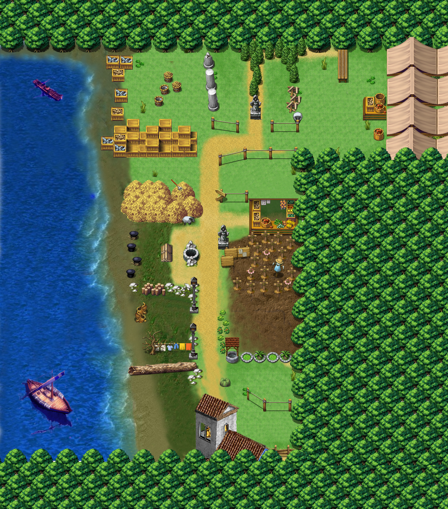

# movin_rpg

Game created during the Movin Hackathon 2015. A small RPG game that uses the Movin indoor location system to identify different regions inside a building which are classified as rooms with monsters. A small interface for combat allows for combat and gathering of xp.

## RPG Map

